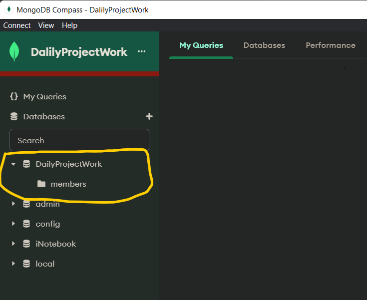
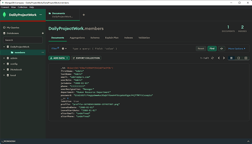

# Daily Project  Work Entry

The DPRS project is an advanced and comprehensive solution that provides a comprehensive dashboard with detailed data analysis capabilities, including day, week, and month-wise data visualization through various graphs. The dashboard also includes a work hours summary and weekly work data, along with a work list that allows for easy verification, update, and deletion of DPRS entries. The DPRS module allows for easy addition of DPRS entries by member and project name, along with the ability to track work hours and management support hours, and in/out times of members. The master module includes a comprehensive list of both members and clients, with the ability to add, update, and delete entries for both. The member list includes detailed information such as first name, last name, email, phone, role, designation, department, password, and profile, while the client list includes client name, code, and country. The report module provides detailed activity reports and summaries, which can be filtered by date, member name, and project. The profile module allows users to view and update their personal details, and also includes a password reset feature. The project also includes a login page, where users can log in with their email and password, and a password recovery feature that allows users to reset their password via email.

## Table of Contents
- [Installation](#installation)
- [Usage](#usage)
- [Contribution](#contribution)
- [License](#license)
- [Screenshots/Demo](#screenshots-demo)
- [Contact](#contact)
- [FAQ](#faq)

## Installation

#### Downloads :
we need some tool and IDEs. 
- #### VSCODE : (https://code.visualstudio.com/download)
- #### Node : (https://nodejs.org/en/download/)
- #### MongoDb : (https://www.mongodb.com/try/download/community) [we can now used community server]
    ##### if you not geting MongoDB Compass while installing MONGODB then install 
- #### MongoDBCompass : (https://www.mongodb.com/try/download/compass)

## Usage

### <u> Installation Commands : </u>

Open your project folder and Run code in terminal
<br>
```
npm i
cd '.\Daily Project Work Entry\'
npm uninstall --save chart.js react-chartjs-2
npm install --save chart.js react-chartjs-2
npm i --save chart.js@3.9.1
npm i
cd .\Backend\
npm i
cd..
npm run both 
 
```

## Contribution


### <u>You Need to Change</u>
#### you need to change MongoDb  connect link
<br>

[db.js](./Daily%20Project%20Work%20Entry/Backend/db.js)

```
const mongoURI = "mongodb://localhost:27017/DailyProjectWork?directConnection=true&readPreference=primary&appname=DailyProjectWork"; 
```

mongoURI change with your link

[auth.js](./Daily%20Project%20Work%20Entry/Backend/routers/auth.js)
```
let MyPassword = 'xxxxxxxx'
let MyEmailId = 'xxxxx@gmail.com'
```
here Password is Two-step verification 
<br>
<br>

## <u>Connect to Database</u>
#### In this app you required minimum one Member who can exess the app So let see how can add database 
<br>

### <u>MongoDb Compass Connection String</u>
For that you need to MongoDb Compass and open the Connection panel which is look like this..


Here, If you Want to Change then Update connection string Or As well Same 

### <u>MongoDb Compass Document</u>
when you connect MongoDb then you Create Database as Name of **"DailyProjectWork"** 

then after You can create Collection as Name of **"members"**



**NOTE :** Here it'scompulsory to correct Name otherwise  get Errors

### <u>MongoDb Compass HOW TO ADD DATA-FILE</u>
After  Complted Creation collection, you need to add Data file So you can add like below image


you can select "Import file" option to add Data file.


##3 <u>MongoDb Compass Adding Json File</u>
we have json file which is already avilable in Code

**Path of Json File :** [members.json](./Database/members.json)

**User Name :** admin@dprs.com
**Password :** admin


Now you can done Successfully then look like this Windows

### <u>MongoDb Compass After completed Data to React application</u>



### After complted this you can able to Run DPRS Application 
<br>

## License

This project is licensed under [MIT License](./License) 2023

<br>

## Screenshots/Demo

Output Images [DPRS](./Outputs)
<br>

## Contact

If you any questions or feedback Contect me [Vidhin Patel](mailto:vidhin1208@gmail.com)

<br>

## FAQ

Thank you !!!
